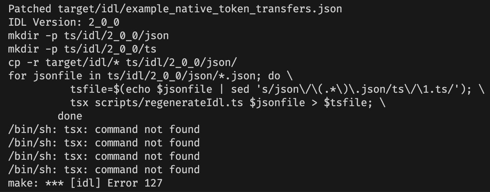

# Solana

## Prequisities

Ensure that you are using the correct version of the Solana and Anchor CLI tools by consulting `Anchor.toml`.

```toml
[toolchain]
anchor_version = "0.29.0"   # CLI
solana_version = "1.18.10"
```

You will also need to install the toolchain listed in `rust-toolchain`. You can verify this by running:

```sh
rustup show
```

## Design Overview

### Message Lifecycle (Solana)

1. **Transfer**

A client calls the [transfer_lock] or [transfer_burn] instruction based on whether the program is in "locking" or "burning" mode. The program mode is set during initialization. When transferring, the client must specify the amount of the transfer, the recipient chain, the recipient address on the recipient chain, and the boolean flag `should_queue` to specify whether the transfer should be queued if it hits the outbound rate limit. If `should_queue` is set to false, the transfer reverts instead of queuing if the rate limit were to be hit.

> Using the wrong transfer instruction, i.e. [`transfer_lock`] for a program that is in "burning" mode, will result in `InvalidMode` error.

Depending on the mode and instruction, the following will be produced in the program logs:

```
Program log: Instruction: TransferLock
Program log: Instruction: TransferBurn
```

Outbound transfers are always added into an Outbox via the `insert_into_outbox` method. This method checks the transfer against the configured outbound rate limit amount to determine whether the transfer should be rate limited. An `OutboxItem` is a Solana Account which holds details of the outbound transfer. If no rate limit is hit, the transfer can be released from the Outbox immediately. If a rate limit is hit, the transfer can only be released from the Outbox after the rate limit delay duration has expired.

2. **Rate Limit**

The program checks rate limits via the `consume_or_delay` function during the transfer process. The Solana rate limiting logic is equivalent to the EVM rate limiting logic.

If the transfer amount fits within the current capacity:

- Reduce the current capacity
- Refill the inbound capacity for the destination chain
- Add the transfer to the outbox with `release_timestamp` set to the current timestamp, so it can be released immediately.

If the transfer amount does not fit within the current capacity:

- If `shouldQueue = true`, add the transfer to the outbox with `release_timestamp` set to the current timestamp plus the configured `RATE_LIMIT_DURATION`.
- If `shouldQueue = false`, revert with a `TransferExceedsRateLimit` error

3. **Send**

The caller then needs to request each Transceiver to send messages via the [`release_outbound`] instruction. To execute this instruction, the caller needs to pass the account of the Outbox item to be released. The instruction will then verify that the Transceiver is one of the specified senders for the message. Transceivers then send the messages based on the verification backend they are using.

For example, the Wormhole Transceiver will send by calling [`post_message`] on the Wormhole program, so that the Wormhole Guardians can observe and verify the message.

> When `revert_on_delay` is true, the transaction will revert if the release timestamp has not been reached. When `revert_on_delay` is false, the transaction succeeds, but the outbound release is not performed.

The following will be produced in the program logs:

```
Program log: Instruction: ReleaseOutbound
```

4. **Receive**

Similar to EVM, Transceivers vary in how they receive messages, since message relaying and verification methods may differ between implementations.

The Wormhole Transceiver receives a verified Wormhole message on Solana via the [`receive_message`] entrypoint instruction. Callers can use the [`receive_wormhole_message`] Anchor library function to execute this instruction. The instruction verifies the Wormhole VAA and stores it in a `VerifiedTransceiverMessage` account.

The following will be produced in the program logs:

```
Program log: Instruction: ReceiveMessage
```

[`redeem`] checks the inbound rate limit and places the message in an Inbox. Logic works the same as the outbound rate limit we mentioned previously.

The following will be produced in the program logs:

```
Program log: Instruction: Redeem
```

5. **Mint or Unlock**

The inbound transfer is released and the tokens are unlocked or minted to the recipient (depending on the mode) through either [`release_inbound_mint`] (if the mode is `burning`) or [`release_inbound_unlock`] (if the mode is `locking`). Similar to transfer, using the wrong transfer instruction, i.e. [`release_inbound_mint`] for a program that is in "locking" mode, will result in `InvalidMode` error.

> When `revert_on_delay` is true, the transaction will revert if the release timestamp has not been reached. When `revert_on_delay` is false, the transaction succeeds, but the minting/unlocking is not performed.

Depending on the mode and instruction, the following will be produced in the program logs:

```
Program log: Instruction: ReleaseInboundMint
Program log: Instruction: ReleaseInboundUnlock
```

## Message Customization

See the [NttManager](../docs/NttManager.md) doc for wire format details.

### NativeTokenTransfer Additional Payload

Modify [transfer.rs](./programs/example-native-token-transfers/src/transfer.rs) and replace the `EmptyPayload` with your own custom struct. See [ntt.rs](./modules/ntt-messages/src/ntt.rs) for an example. It is highly encouraged to use a 4-byte prefix for your payload.

The additional payload field should then have your custom struct available everywhere `NativeTokenTransfer<Payload>` is used. Due to typing, parsing, and account allocation restrictions, this implementation expects that _all_ `NativeTokenTransfer` payloads for your contract adhere to your custom struct definition.

You can then modify [release_outbound](./programs/example-native-token-transfers/src/transceivers/wormhole/instructions/release_outbound.rs) and [redeem](./programs/example-native-token-transfers/src/instructions/redeem.rs) to generate and process the additional payload.

## Testing

The test files are loacated in the `sdk/solana/__tests__/` directory

In order to run them, the Solana programs must be built and their IDL made available to the SDK.

To ensure the SDK has the generated IDL, run the tests with the make command:

```sh
make test
```

### Troubleshooting

<details>
<summary><code>make: *** No rule to make target `test'.  Stop.</code></summary>

- Ensure `Makefile` has target `test`
</details>

<details>
<summary><code>tsx: command not found</code></summary>

- Screenshot:
  
- Update `Makefile` ([line #29](https://github.com/wormhole-foundation/example-native-token-transfers/blob/main/solana/Makefile#L29)) from:

  ```sh
  tsx scripts/regenerateIdl.ts $$jsonfile > $$tsfile; \
  ```

  to:

  ```sh
  npx tsx scripts/regenerateIdl.ts $$jsonfile > $$tsfile; \
  ```

  </details>

  <details>
  <summary><code>Lifecycle script `build:esm` failed with error</code></summary>

  - Screenshot:
    
  - This occurs due to Typescript files failing compilation.
  - [`patch-idl` script](https://github.com/wormhole-foundation/example-native-token-transfers/blob/main/solana/scripts/patch-idl) requires [`jq`](https://jqlang.github.io/jq/) to be installed. Install `jq` and retry.

  </details>
